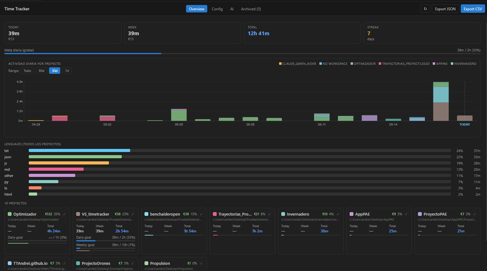
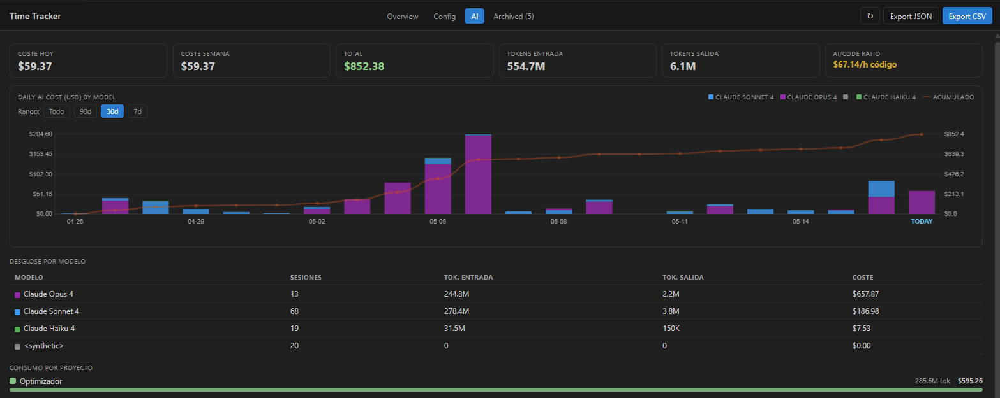
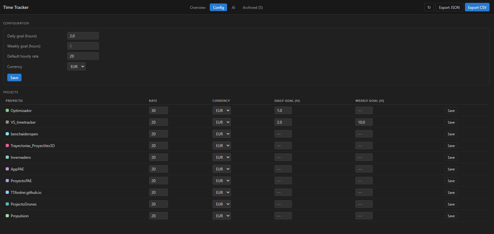

# TT-TimeTracker

Track your coding time, project costs, daily goals, and AI usage — all inside VS Code.

Dashboard available in **English** and **Español** (auto-detects the VS Code UI language; switch any time with the 🌐 button or the `Language` command).

---

## Screenshots

### Overview

### AI usage

### Configuration

---

## Features

### Automatic Time Tracking
Tracks active coding time per project. Detects idle periods and stops the timer automatically. No manual start/stop required.

### Dashboard
Full overview of all your projects with:
- Daily and weekly time
- Progress bars toward your goals
- Streaks and language breakdown
- Cost estimates based on hourly rate

### Pomodoro Timer
Built-in Pomodoro timer integrated with the tracker:
- Configurable work/break durations (default 25/5 min)
- Status bar countdown
- Session count per project
- Notifications on phase completion

### Goals & Streaks
Set daily and weekly hour goals per project or globally. Get notified when you hit your target. Streak counter rewards consistent coding days.

### Cost Tracking
Set an hourly rate per project (or globally). Dashboard shows earnings per project and totals.

### AI Usage Tracking
Parses Claude Code logs to show token usage and cost per model — useful for tracking AI expenses alongside coding time.

### Session Notes & Tags
Add notes and tags to sessions (e.g. `bug`, `feature`, `meeting`). Filter the dashboard by tag to analyze time by task type.

### Export
Export all session data as **CSV** or **JSON** for billing, reporting, or external analysis.

### Archive
Archive completed or inactive projects. Restore at any time from the Archive tab.

---

## Getting Started

1. Install the extension
2. Open any project folder in VS Code
3. Start coding — tracking begins automatically
4. Open the dashboard: `Ctrl+Shift+P` → `VSCode Tracker: Show Dashboard`

---

## Commands

| Command | Description |
|---|---|
| `VSCode Tracker: Show Dashboard` | Open the full dashboard |
| `VSCode Tracker: Configure Current Project` | Set rate, goals, currency for active project |
| `VSCode Tracker: Start Pomodoro` | Start a Pomodoro session |
| `VSCode Tracker: Skip Pomodoro Phase` | Skip current work or break phase |
| `VSCode Tracker: Stop Pomodoro` | Stop the Pomodoro timer |
| `VSCode Tracker: Add Note to Last Session` | Add tags and notes to the last session |
| `VSCode Tracker: Export CSV` | Export all data as CSV |
| `VSCode Tracker: Export JSON` | Export all data as JSON |
| `VSCode Tracker: Log AI Usage` | Manually log AI model usage |
| `VSCode Tracker: Reset Today Stats` | Clear today's sessions |
| `VSCode Tracker: Reset All Data` | Delete all tracking data |
| `VSCode Tracker: Language (English / Español)` | Switch the dashboard language |

---

## Configuration

| Setting | Default | Description |
|---|---|---|
| `vscodeTracker.language` | `auto` | Dashboard language: `auto`, `en`, `es` |
| `vscodeTracker.idleThresholdSeconds` | `300` | Seconds of inactivity before session ends |
| `vscodeTracker.unfocusedGraceSeconds` | `900` | Seconds the window can stay unfocused before the session ends |
| `vscodeTracker.dailyGoalHours` | `0` | Global daily goal in hours (0 = disabled) |
| `vscodeTracker.weeklyGoalHours` | `0` | Global weekly goal in hours (0 = disabled) |
| `vscodeTracker.defaultHourlyRate` | `0` | Default hourly rate (0 = disabled) |
| `vscodeTracker.currency` | `EUR` | Currency: EUR, USD, GBP, CHF, JPY |
| `vscodeTracker.pomodoroWorkMinutes` | `25` | Pomodoro work phase duration |
| `vscodeTracker.pomodoroBreakMinutes` | `5` | Pomodoro break phase duration |
| `vscodeTracker.breakReminderHours` | `2` | Break reminder after N continuous hours (0 = disabled) |
| `vscodeTracker.enableLanguageTracking` | `true` | Track time by file language |
| `vscodeTracker.enableAITracking` | `true` | Parse Claude Code logs for AI cost tracking |
| `vscodeTracker.aiCustomModels` | `[]` | Custom AI model pricing for non-Claude models |
| `vscodeTracker.promptForNotes` | `false` | Auto-prompt for notes when a session ends |

---

## Data Storage

All data is stored locally in `~/.vscode-tracker/`:
- `logs.json` — session history
- `projects.json` — project config and metadata
- `pomodoro.json` — Pomodoro session history

No data is sent to any server.

---

## License

MIT © Andrei Akirov
